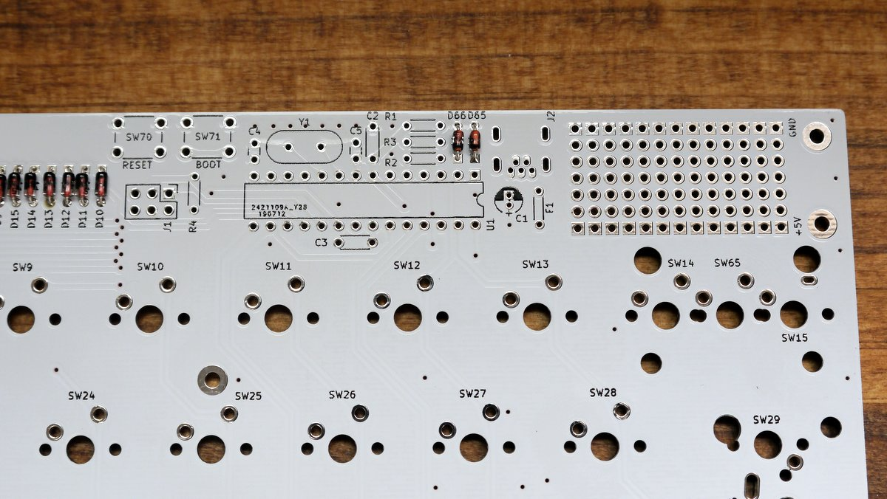
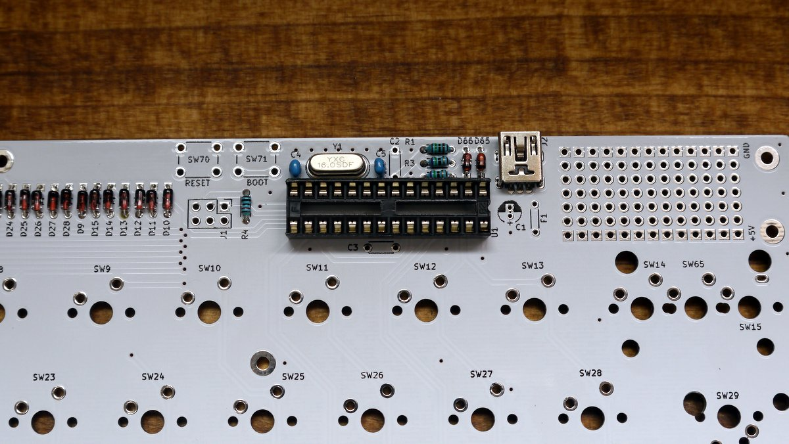
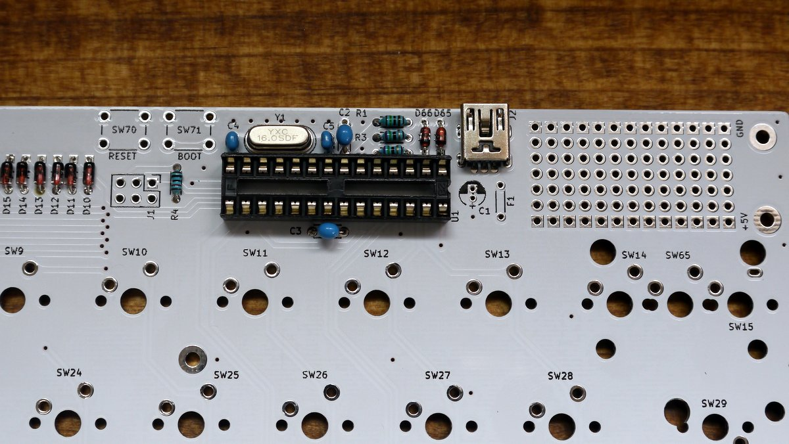
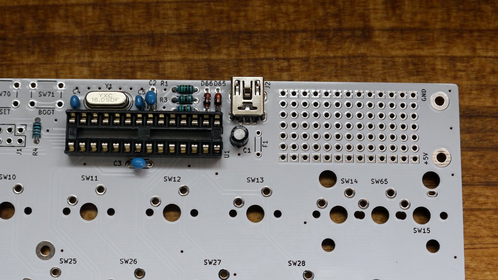

# はんだづけ

## 組立を始める前に
- 部品が揃っているか[BOM](./BOM.md)を見て確認する
- もしはんだづけに不慣れなら以下のサイトで勉強する
  - [Helixキーボードキットの制作に必要な工具メモ](https://gist.github.com/mtei/6957107a676ddfa85bde0ae41f8fa849)内の[リンク集 - はんだづけ編](https://gist.github.com/mtei/6957107a676ddfa85bde0ae41f8fa849#%E3%83%8F%E3%83%B3%E3%83%80%E4%BB%98%E3%81%91%E7%B7%A8)
  - https://learn.adafruit.com/adafruit-guide-excellent-soldering/tools

## はんだづけ
### ダイオード(1N4148)
D1-D64をはんだづけします。   
ダイオードは`極性`があります。向きに注意して下さい。   
ダイオードの黒い帯がある方がカソードです。(PCBの四角いパッド側)   

### ツェナーダイオード
D65,D66をはんだづけします。
ダイオードは`極性`があります。向きに注意して下さい。   
ダイオードの黒い帯がある方がカソードです。(PCBの四角いパッド側)   

### 抵抗
抵抗をはんだづけします。

|Ref   |値  |カラーコード  |
|------|----|-------------|
|R1    |1.5k|茶/緑/黒/茶/茶|
|R2,R3 |75  |紫/緑/黒/金/茶|
|R4    |10k |茶/黒/黒/赤/茶|

### クリスタルと積層セラミックコンデンサ(22pF)
積層セラミックコンデンサは2種類あります。   
リードの間隔で判別できます。

| Ref  | 値    | リードの間隔 |
|------|-------|------------|
| C4,5 | 22pF  | 2.5mm      |

### USBコネクタ
ピンの間隔が狭いのでブリッジに注意して下さい。   
はんだづけしたあとによく確認すること。

### ICソケット
ICソケットは`向き`があります。   
ICソケットの端の切り欠けとPCB上のシルクをあわせます。

### 積層セラミックコンデンサ(0.1uF)
積層セラミックコンデンサは2種類あります。   
リードの間隔で判別できます。

| Ref  | 値    | リードの間隔 |
|------|-------|------------|
| C2,3 | 0.1uF | 5mm        |

### 電解コンデンサ(C1)
電解コンデンサは`極性`があります。向きに注意して下さい。   
短い足の方がカソードです。(PCBの四角いパッドの方)

### リセッタブルフューズ(F1)

### タクタイルスイッチとピンヘッダ

### ATMEGA328P
ATMEGA328PをICソケットに差し込みます。

ATMEGA328Pは`極性`があります。向きに注意して下さい。   
ICソケットの切り欠けとATMEGA328Pの切り欠けをあわせます。   
画像も参考にして下さい。

## USBケーブルを接続する前のチェックリスト
- VCC(5V)とGNDがショートしていないか、USBコネクタのピンがショートしていないか
- 極性のある部品の向き(ATMEGA328P、ダイオード、リセッタブルヒューズ、電解コンデンサ)
- 抵抗の値と場所

## NEXT
[USBケーブルを接続してブートローダをテストする](./bootloader.md)